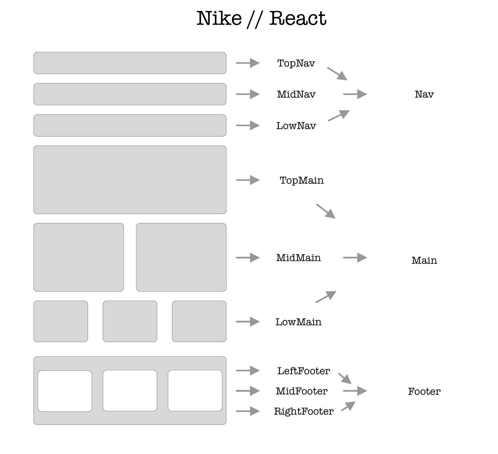
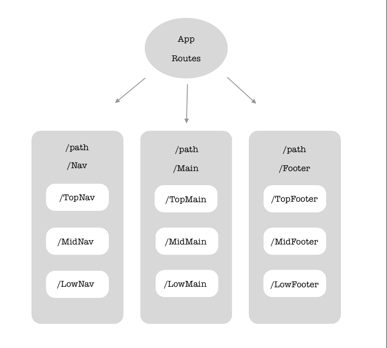
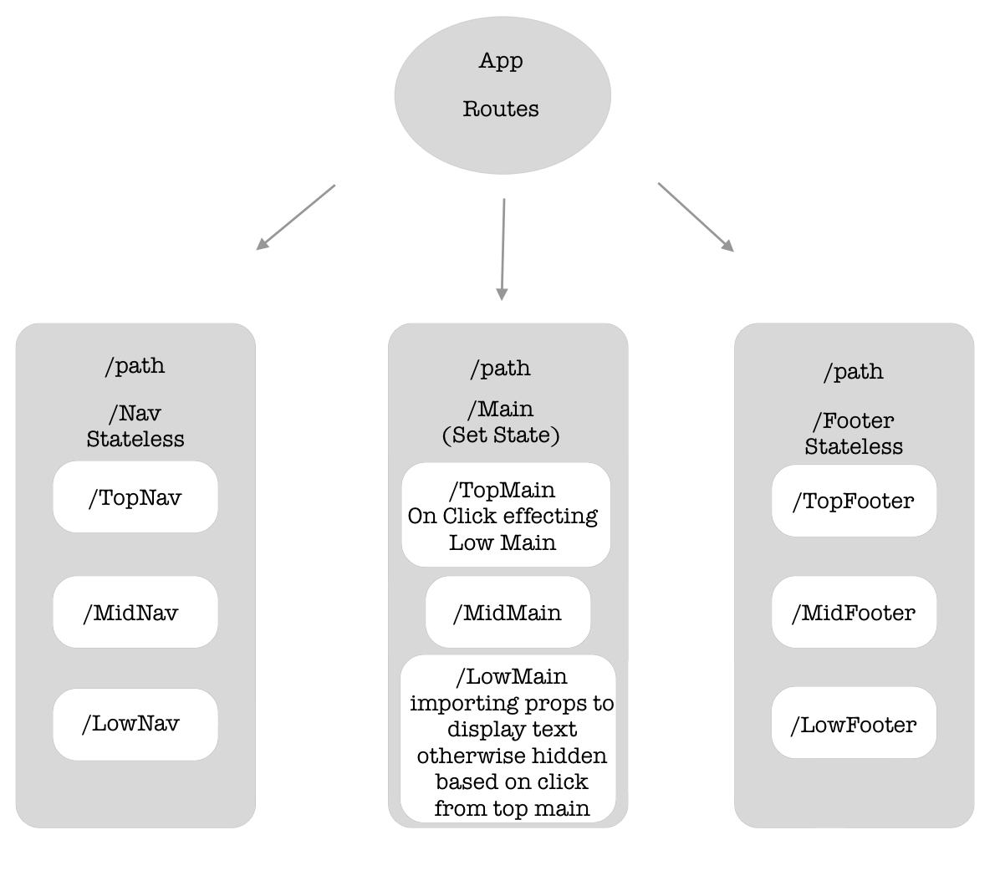

### Nike Clone // React

#### {04/19/19} initial start  // {04/26/19} continuation

This project was bootstrapped with [Create React App](https://github.com/facebook/create-react-app).

## Description
https://www.nike.com/ clone using React
* npx create-react-app webpack creation
* https://www.styled-components.com/ used for styling

* Styled Components creates the largest separation of working environment between React and Angular.

* React .js files allows for all information (HTML / CSS / JS) to rest on a single file (unless global rules are created on a separate file and called in APP) opposed to Angular which has a similar separation of information, but to a more specific degree that can become cumbersome.

## Specs
* User will be able to manipulate the screen size and the information provided will render to that viewport accordingly
* User will be able to click on buttons in the top left of the Navbar to receive and extra bonus when shopping!
* User will be able to click on links in the navigation bar and be directed to the corresponding area on nike

### Original Website
* 

### Screenshot // Sketch
* 
* 

### Screenshot // Sketch with State
* 

### Setup/Installation Requirements
* As of 04/26/19:
* Open your preferred browser
* copy / paste
* https://github.com/Robbiekruszynski/Nike-React
* Make sure you're in your Desktop directory
* clone or download the following https://github.com/Robbiekruszynski/Nike-React.git
* Open your terminal and navigate to the react-nike directory
(cd desktop --cd react-nike)
* Once in your terminal and proper directory run the command
`yarn install` (provided you are free of errors continue and run the next command)
* In the project directory, you can run:
`yarn start`
* Runs the app in the development mode. 
* Open [http://localhost:3000](http://localhost:3000) to view it in the browser.
* The page will reload if you make edits. 
* You will also see any lint errors in the console.
* `yarn test`
* Launches the test runner in the interactive watch mode. 
See the section about [running tests](https://facebook.github.io/create-react-app/docs/running-tests) for more information.
* `yarn run build`
* Builds the app for production to the `build` folder. 
* It correctly bundles React in production mode and optimizes the build for the best performance.
* The build is minified and the filenames include the hashes. 

## Known Bugs
_As of April 26th 2019 there are no known bugs_

## List of Technologies Resources
* HTML
* Styled-Components ( https://www.styled-components.com/ )
* ESlinter
* React

## Learn More
You can learn more in the [Create React App documentation](https://facebook.github.io/create-react-app/docs/getting-started).
To learn React, check out the [React documentation](https://reactjs.org/).

## Notes
* Successfully implemented Routing along with state vs stateless within corresponding paths.  

#### Developmental Roadmap
* Continue to build out styled features
* Push for pixel perfect Navigation bar and Footer
* Add functionality to Clone

### License

*{This software is licensed under the MIT license} Copyright (c) 2019 {Robbie Kruszynski}*

Copyright (c) 2019
**_Robbie Kruszynski_**
